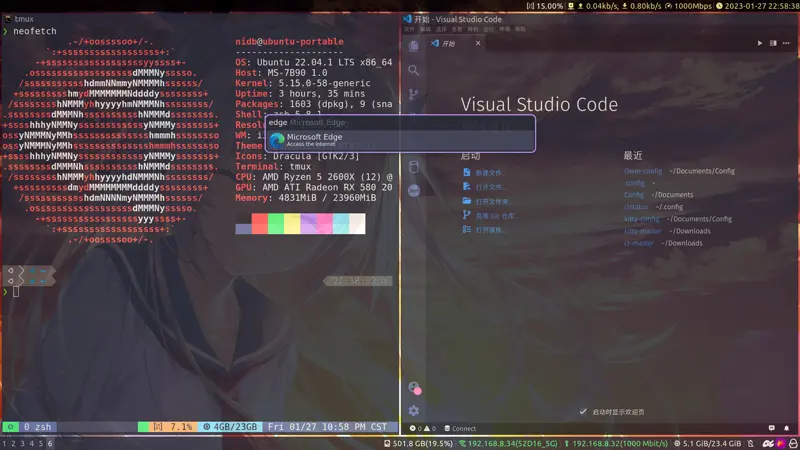

# i3wm config

This repositry contains my i3wm config files.



> alert: Those config files were first wrote in 2021/1/10, there maybe some thing wrong.

Where is Chinese version? I haven't install my Chinese input method, so there is no README_zh-cn.md. But you can alwayse start a issue in Chinese and I may replay you in English.

## Features

* Icons on status bar

## Prerequirement

To show icons on i3status bar, you need install a nerd-font, the default font in my config is `Glow Sans SC` for Chinese.

And one of them for English:

* CaskaydiaCove NF
* DejaVuSansMono NF
* FiraCode NF
* JetBrainsMono NF
* Ubuntu NFF

You can install those fonts via download font files, move them to `/usr/local/share/fonts` and run `fc-cache -f -v`.

Useful links:

* [github.com:welai/glow-sans](https://github.com/welai/glow-sans)
* [github.com:ryanoasis/nerd-fonts](https://github.com/ryanoasis/nerd-fonts)

### Recommend Apps

This config have set bind for those apps:

* kitty:`Mod+Enter`
* flameshot:`Mod+Shift+S`
* Jetbrains Toolbox:`Mod+B`
* Visual Studio Code: `Mode+C`
* Microsoft Edge: `Mode+E`

## Installation

```sh
git clone https://github.com/nidbCN/i3wm-config.git ~/Documents/Config/
./link.sh
```

This script will create link from `.config/i3` to this repositry.

## Any Question

Just start a new issue!
